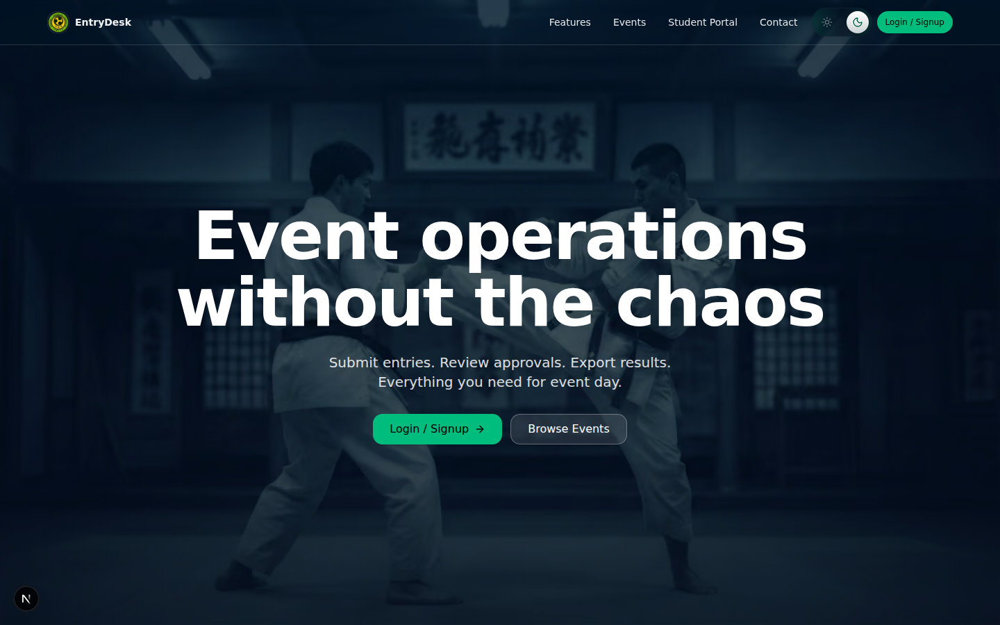
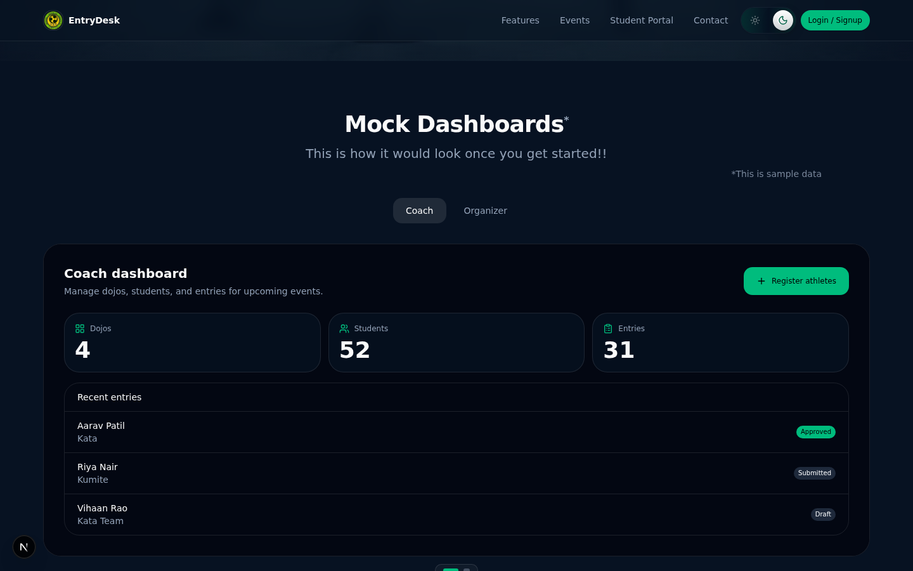
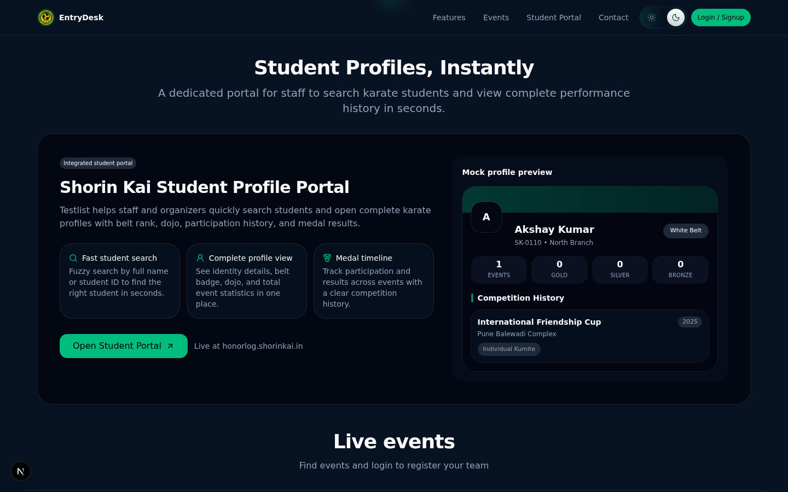
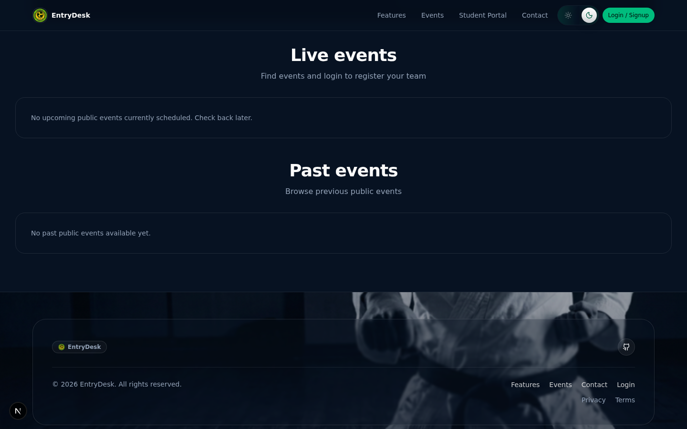

  <h1>🥋 EntryDesk</h1>
  
<strong>The Open-Source Tournament Operations & Event Management Platform</strong>

  
  
  
  

## 📖 About EntryDesk

Most grassroots martial arts events still operate on fragmented spreadsheets, paper entries, and ad-hoc messaging. 

**EntryDesk** is a highly optimized, role-based web application designed to standardize and scale martial arts tournaments. It gives **organizers** a central hub to create events, review coach applications, approve athlete entries, and export finalized rosters — while giving **coaches** an intuitive pipeline to register their students and track entry statuses in real time.

Whether you run a local dojo competition or a regional federation championship, EntryDesk replaces the chaos of spreadsheets and WhatsApp groups with a reproducible, self-hosted platform — no lock-in, no per-event fees.

## 📸 Screenshots

<table>
  <tr>
    <td align="center" colspan="2">
      <strong>Landing Page</strong> 
      
    </td>
  </tr>
  <tr>
    <td align="center">
      <strong>Coach & Organizer Dashboards</strong> 
      
    </td>
    <td align="center">
      <strong>Student Portal</strong> 
      
    </td>
  </tr>
  <tr>
    <td align="center" colspan="2">
      <strong>Browse Upcoming Events</strong> 
      
    </td>
  </tr>
</table>

## 🌍 Open Source Impact & Maintainership

**Maintainers & Project Owners:** [@ull0sm](https://github.com/ull0sm) and [@bugsNburgers](https://github.com/bugsNburgers) 

As the primary maintainer, my vision is to ship core operational infrastructure to the martial arts ecosystem. EntryDesk acts as a public good for organizers globally. I actively maintain the codebase, review pull requests, and manage the database schema to ensure security, high performance, and accessibility for any organization wanting to host a tournament.

## 🌟 Key Features

### 🛠️ For Organizers
- **Full-Lifecycle Event Management**: Effortlessly create, schedule, and manage public or private events.
- **Approval Workflows**: Review and manage coach applications through a dedicated pipeline.
- **Unified Entry Management**: Leverage real-time views (`organizer_entries_view`) for comprehensive roster access.
- **Frictionless Export**: Instant Excel/CSV data dumps for operational bracket management.
- **Advanced Dashboards**: Interactive, deep-linked analytics cards tailored for operational velocity.

### 🥋 For Coaches
- **Roster & Dojo Hub**: Centralized location for managing students and dojo metadata.
- **Registration Pipelines**: Seamlessly map eligible students to upcoming events.
- **Entry State Machine**: Track granular statuses (`draft`, `submitted`, `approved`, `rejected`).

### 💻 Product & Design Architecture
- **Instant Feedback**: Optimistic UI loops, determinate loading overlays, and smooth transition APIs.
- **History-Aware Navigation**: Context-preserving "one-step back" behavior eliminating frustrating list-jumps.
- **Modern Aesthetic**: Clean, athletic-inspired design using [Tailwind CSS v4](https://tailwindcss.com/) and [Radix UI](https://www.radix-ui.com/).

## 🛠 Tech Stack

- **Framework**: [Next.js](https://nextjs.org/) (App Router)
- **UI & Styling**: [React](https://react.dev/), [Tailwind CSS v4](https://tailwindcss.com/)
- **Backend & Database**: [Supabase](https://supabase.com/)
  - Authentication (Email/Password + Google OAuth)
  - PostgreSQL Database (Tables + RLS Policies)

## 🚀 Quick Start & Installation

We've made spinning up a local instance of EntryDesk as smooth as possible.
    
👉 **See the [QUICKSETUP.md](QUICKSETUP.md) guide for detailed installation, environment, and database configuration instructions.**

## 📚 Documentation & Contributing

We believe robust software is built collaboratively. We welcome issues, bug reports, and pull requests!

- **[Contribution Guidelines](CONTRIBUTING.md)**: How to submit features and fixes.
- **[Changelog](CHANGELOG.md)**: Explore our latest updates and roadmaps.

## 🤝 Contributors

EntryDesk is made possible by our amazing community. Thank you to everyone who has helped build and improve this platform!

**Core Maintainers:** [@ull0sm](https://github.com/ull0sm) and [@bugsNburgers](https://github.com/bugsNburgers)

### All Contributors

---

  <i>Built with ❤️ for the karate community</i>

